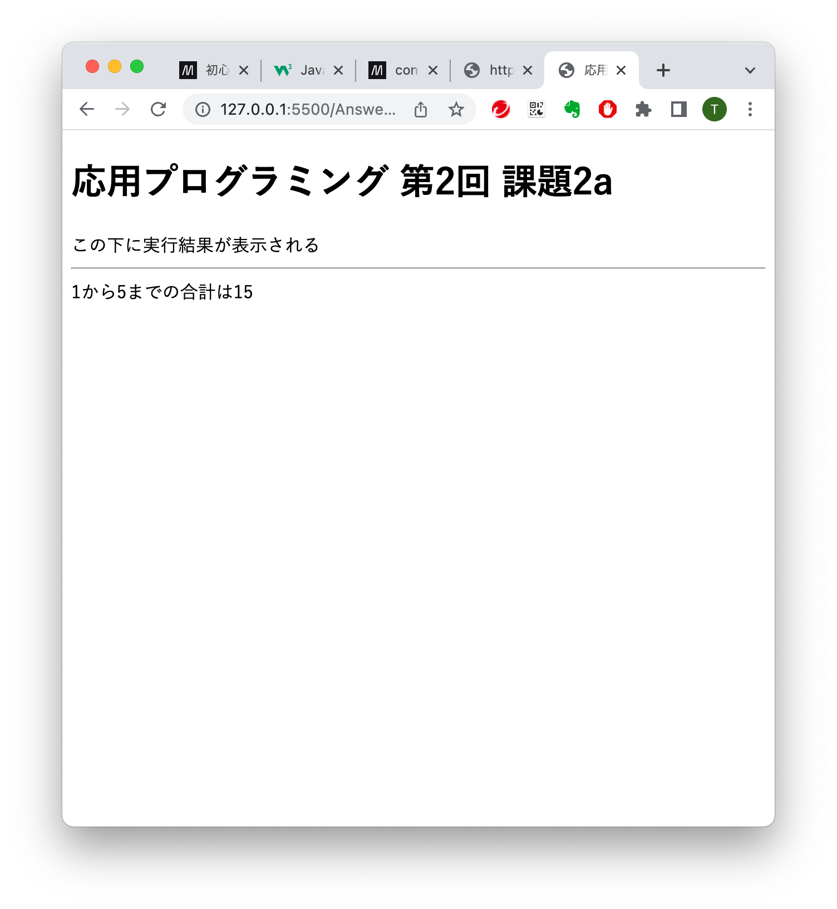
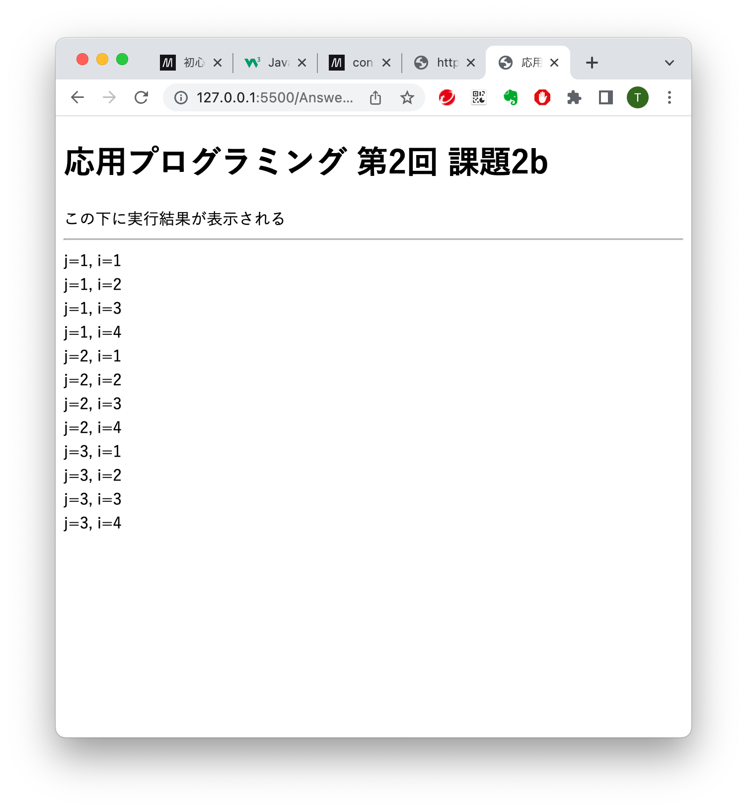
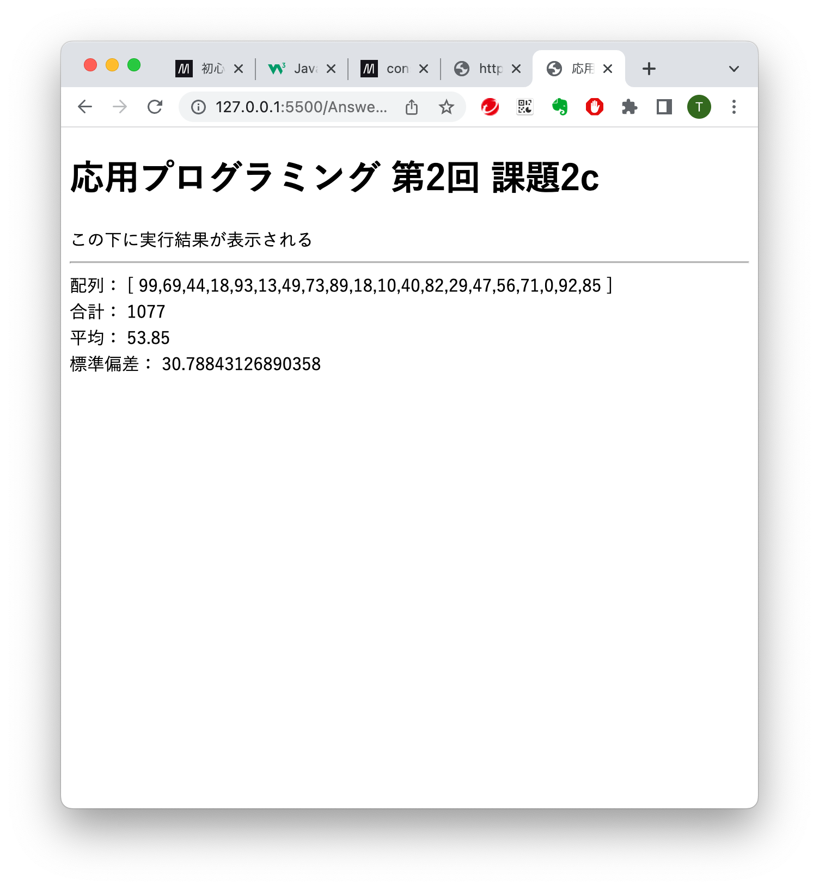
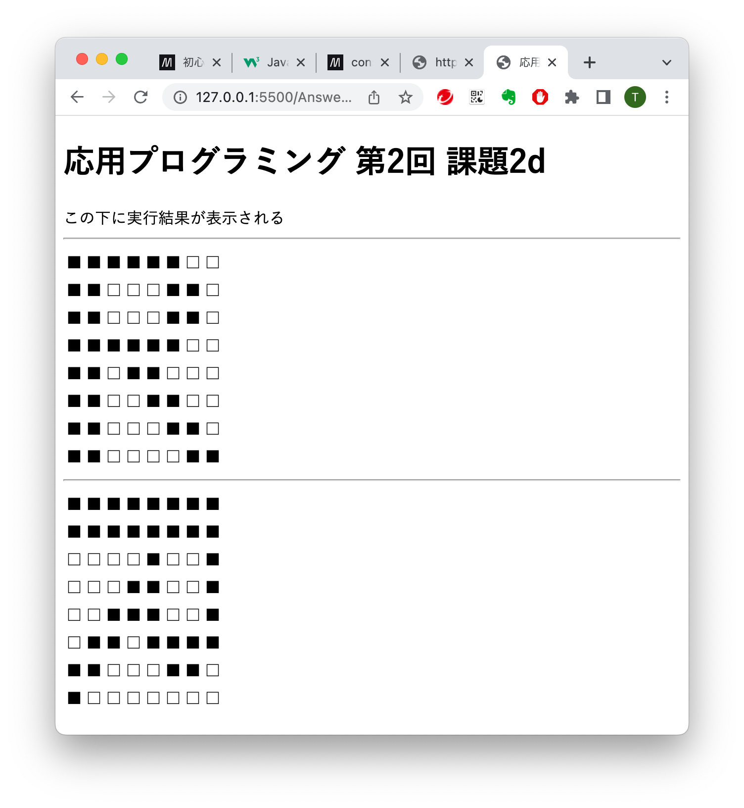

# 応用プログラミング 2022年度

## 第2回 課題2

1. GitHub上のリポジトリのクローンを自分のPCに作成する

1. クローンしたローカルリポジトリをVisual Studio Code(以下，VS Code) で開く

1. VS Code の Live Server を使って，表示を確認する．(初期コードには4つの課題がある)

    * ap0202a.html で，1から15の合計が表示されるように，ap0202a.js を修正する．

    

    * ap0202b.html で，図のように12行の出力が表示されるように，ap0202b.js を修正する．

    

    * ap0202c.html で，図のように 20個の乱数の合計，平均，標準偏差が表示されるように，ap0202c.js を修正する．

    

    * ap0202d.html で，図のような出力が表示されるように，ap0202d.js を修正する．

    

1. 変更をコミット(commit)してから，プッシュ(push)し，GitHub上のリポジトリが更新されていることを確認する．

1. 教員(またはSA)による，提出確認を受ける．